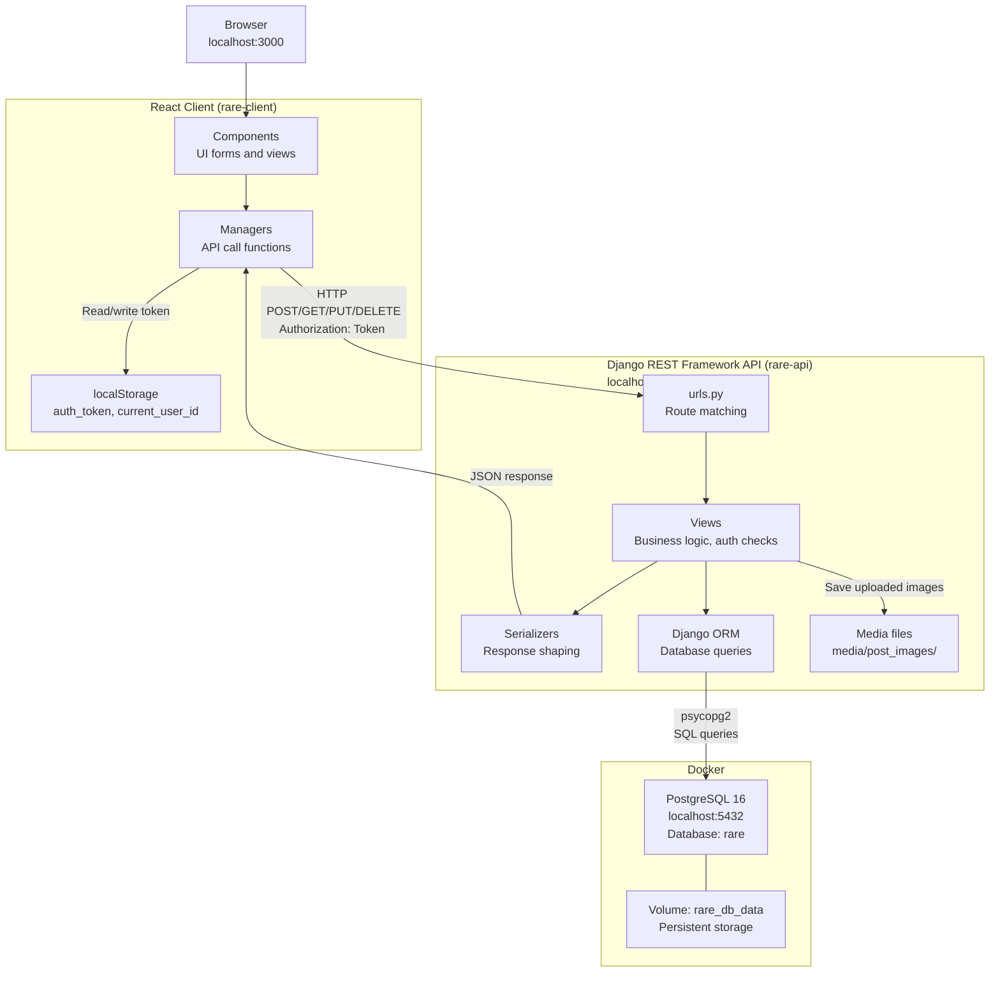

# Rare System Architecture

## Components

| Component | Technology | Responsibility |
|---|---|---|
| React Client | Create React App, Bulma, react-router-dom | UI, routing, token storage |
| Managers | Plain JS fetch functions | One file per resource — abstracts all API calls from components |
| Django API | Django 4.2 + Django REST Framework | Auth, business logic, moderation rules |
| Views | DRF function-based views | Handle HTTP methods, enforce permissions, read `request.data` |
| Serializers | DRF ModelSerializers | Shape ORM objects into JSON responses |
| PostgreSQL | Postgres 16 in Docker | Persistent relational storage |
| Media files | Local filesystem | Uploaded post and profile images stored under `media/` |

## Communication

- **Client → API**: JSON over HTTP. Every authenticated request includes `Authorization: Token <token>` in the header. CORS is restricted to `localhost:3000`.
- **API → Database**: Django ORM via the psycopg2 driver. No raw SQL.
- **Auth flow**: Client POSTs credentials to `/login` or `/register`, receives a token, stores it in `localStorage`, and attaches it to all subsequent requests. DRF's `TokenAuthentication` middleware validates the token on every request.
