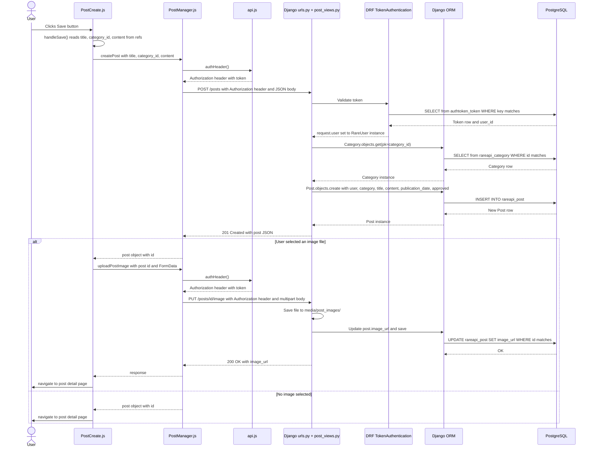

# Create Post — Sequence Diagram

## Notes

- **Approval**: `approved` is set to `request.user.is_staff` at creation time. Admin posts publish immediately; regular user posts are invisible in all public listings until an admin approves them via `PUT /posts/<id>/approve`.
- **Publication date**: Set server-side to today's date. Posts with a future `publication_date` are filtered out of public listings even if `approved=True`.
- **Image upload**: A separate request after the initial POST — if the image upload fails, the post still exists but without an image.
- **Token lookup**: Every authenticated request triggers a DB query to validate the token. DRF's `TokenAuthentication` handles this before the view function runs.
