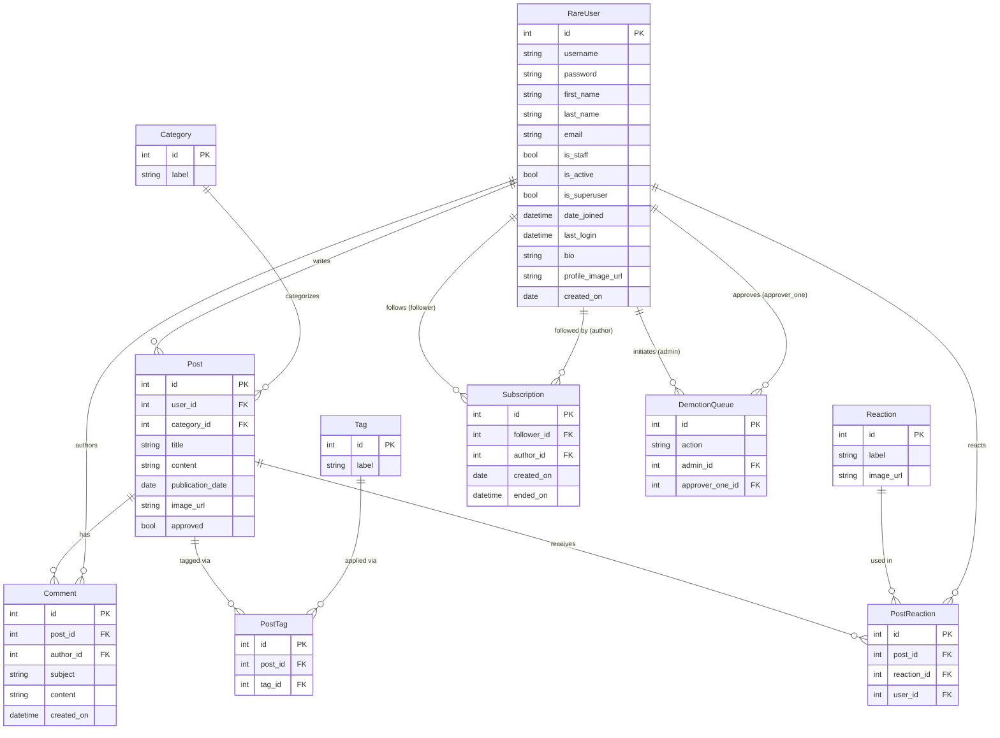

# Rare Database Schema

## Notes

- **RareUser** extends Django's `AbstractUser` — `id`, `username`, `password`, `first_name`, `last_name`, `email`, `is_staff`, and `is_active` are inherited fields
- **PostTag** is a join table implementing the Post ↔ Tag many-to-many relationship
- **PostReaction** is a join table implementing the Post ↔ Reaction many-to-many relationship, scoped per user
- **Subscription.ended_on** is nullable — a null value means the subscription is active; a timestamp means it was cancelled (soft delete)
- **DemotionQueue** has a unique constraint on `(action, admin, approver_one)`
